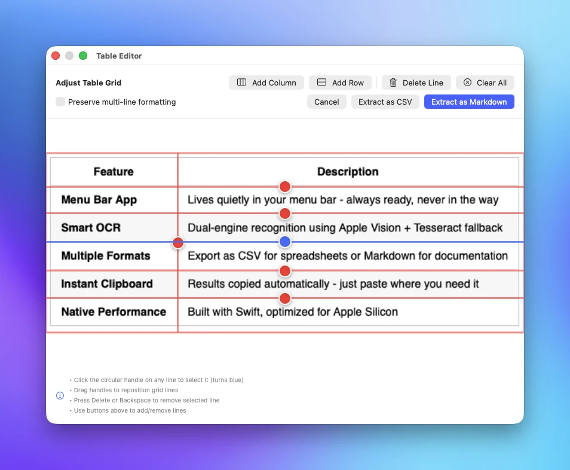
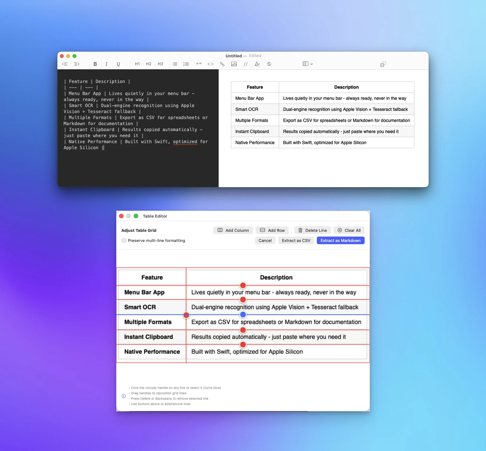
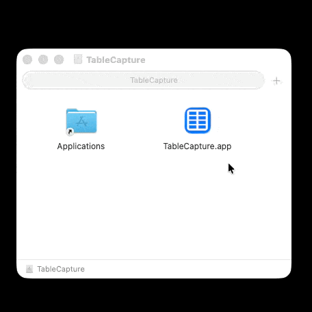

# TableCapture

**Transform any table screenshot into usable data in seconds.**

A lightweight macOS menu bar app that captures screenshots of tables and converts them to CSV or Markdown format, ready to paste anywhere.

---

## Why TableCapture?

Ever needed to copy data from a table in a PDF, screenshot, or image? Manually retyping is tedious and error-prone. TableCapture solves this with one click:

1. **Click** the menu bar icon
2. **Select** the table area on your screen
3. **Paste** - your data is ready in CSV or Markdown

No more manual data entry. No more copy-paste nightmares.

---

## Features

| Feature | Description |
|---------|-------------|
| **Menu Bar App** | Lives quietly in your menu bar - always ready, never in the way |
| **Smart OCR** | Dual-engine recognition using Apple Vision + Tesseract fallback |
| **Multiple Formats** | Export as CSV for spreadsheets or Markdown for documentation |
| **Instant Clipboard** | Results copied automatically - just paste where you need it |
| **Native Performance** | Built with Swift, optimized for Apple Silicon |

---

## Download

### Requirements

- macOS 12.3 (Monterey) or later
- Apple Silicon Mac

### Get TableCapture

[**Download Latest Release**](https://github.com/psenger/TableCapture/releases)

---

## Installation

1. Download and open `TableCapture.dmg`
2. Drag `TableCapture.app` to your Applications folder
3. **Right-click** the app → **Open** (important for first launch)
4. Click **Open** when prompted
5. Grant Screen Recording permission in System Settings

> **First Launch Note**: Since this app is not signed with a paid Developer ID certificate, macOS will show a security warning on first launch. This is a one-time setup:
> 1. Click **OK** to close the popup
> 2. Open **System Settings** > **Privacy & Security**
> 3. Scroll down and click **Open Anyway**
> 4. Confirm your choice if prompted

---

## How It Works

### Step 1: Capture
Click the TableCapture icon in your menu bar and draw a rectangle around any table on your screen.

### Step 2: Process
TableCapture's OCR engine analyzes the image, detects rows and columns, and extracts the text.

### Step 3: Paste
Your formatted data is automatically copied to the clipboard. Paste it into Excel, Google Sheets, Notion, or any text editor.

---

## Use Cases

- **Research** - Extract data from academic papers and reports
- **Finance** - Capture financial tables from PDFs and websites
- **Development** - Convert API documentation tables to code
- **Data Entry** - Speed up tedious manual transcription tasks
- **Documentation** - Quickly grab tables for your own docs

---

## Contributing

Interested in contributing? Check out our [Contributing Guide](CONTRIBUTING.md) for development setup, testing instructions, and how to submit changes.

---

## License

TableCapture is open source software licensed under the [GNU General Public License v3.0](LICENSE.md).

This project uses several open-source libraries. See [ACKNOWLEDGMENTS.md](ACKNOWLEDGMENTS.md) for complete license information and attributions.

---

## Links

- [GitHub Repository](https://github.com/psenger/TableCapture)
- [Report an Issue](https://github.com/psenger/TableCapture/issues)
- [Release Notes](https://github.com/psenger/TableCapture/releases)

---

  <strong>Made with care for macOS</strong> 
  Built by Philip A Senger

